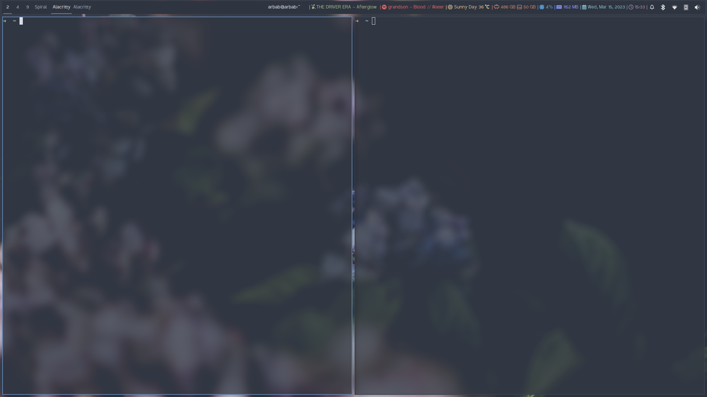
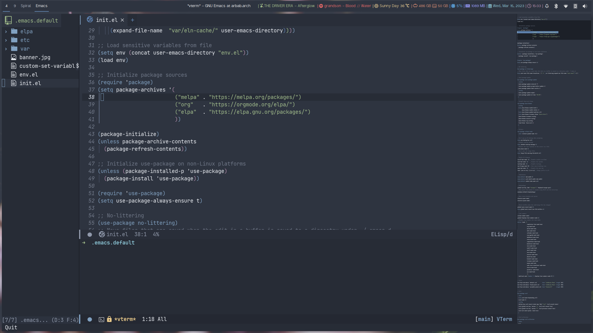
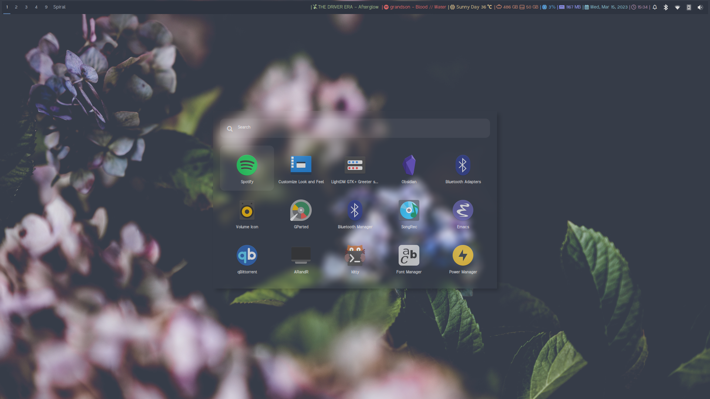

<h1 align="center">Personal Configuration Of Arbab Khan</h1>
This is my personal configuration. This is not meant as a plug and play configuration.

## Table Of Contents

- [About](#about)
- [Showcase](#showcase)
- [Workflow ](#workflow)
- [Important Keybindings](#keybindings)
- [What To Install](#installs)
- [Fonts](#fonts)
- [Addition Notes](#notes)
- [Contributing](#contributing)

## Caution
This repo is tailored towards a 1920x1080 system so things may not look correct on other resolutions. This is something yourself to get working on your system. I might make things a bit more friendly on other resolutions in the future.

You need to be a little familiar with the following to get the most out of this repo

- [Xmonad](https://www.youtube.com/watch?v=3noK4GTmyMw)
- [Rofi](https://www.youtube.com/watch?v=TutfIwxSE_s&t=792s)
- [Bash scripting](https://www.youtube.com/watch?v=PPQ8m8xQAs8)
- [Emacs](https://www.youtube.com/watch?v=48JlgiBpw_I&t=1198s)

I have also linked good beginner resources if you need help with any of these.

This config also took a lot of inspiration from [adi1090x](https://github.com/adi1090x/rofi)'s rofi and [Axarva](https://github.com/Axarva/dotfiles-2.0)'s xmonad configs so check them out.

<a id="about"></a> 
## About
As I said above, this is meant to be my personal configuration that I can clone on my system and get working instantly so many things are tailored to my personal liking. There may be some things you might want to change to get working to your liking.

<a id="showcase"></a> 
## Showcase









<a id="workflow"></a> 
## Workflow
This is meant to be a keyboard centric tiling workflow with vim style bindings and little scripts to make your day a little better.

<a id="keybindings"></a>
## Keybindings
### Xmonad
#### Exit
| Keybind             | Function            |
|---------------------|---------------------|
| `super + shift + c` | Recompile xmonad    |
| `super + q `        | Close window        |
| `super + shift + q` | Open rofi powermenu |
| `alt   + F4`        | Exit xmonad         |
#### Layout
| Keybind             | Function                                  |
|---------------------|-------------------------------------------|
| `super + n`         | Refresh layouts                           |
| `super + Space`     | Cycle through layouts                     |
| `super + t`         | Snap floating window to tiling            |
| `super + up`        | Increase number of windows in master pane |
| `super + down`      | Decrease number of windows in master pane |
| `super + ctrl + f`  | Toggle tile                               |
| `super + shift + f` | Toggle bar (polybar)                      |
| `super + f`         | Fullscreen focused window                 |
#### Move
| Keybind               | Function                          |
|-----------------------|-----------------------------------|
| `super + 1...9`       | Move from workspaces 1 to 9       |
| `super + ctrl + tab`  | Move focus to next display        |
| `super + left/k`      | Move focus to upper window        |
| `super + right/j`     | Move focus to down window         |
| `super + .`           | Warp cursor to focused window     |
| `super + shift + h`   | Hide focused window               |
| `super + ctrl  + h`   | Show last hiddent window          |
| `super + tab`         | Cycle through workspace forwards  |
| `super + shift + tab` | Cycle through workspace backwards |
| `super + m`           | Swap focused windowwith master    |
| `super + alt + up`    | Move window up by 10 pixels       |
| `super + alt + down`  | Move window down by 10 pixels     |
| `super + alt + left`  | Move window left by 10 pixels     |
| `super + alt + right` | Move window right by 10 pixels    |
#### Shift
| Keybind                   | Function                           |
|---------------------------|------------------------------------|
| `super + shift + 1...9`   | Shift to workspaces 1 to 9         |
| `alt   + ctrl + tab`      | Shift to next display              |
| `super + shift + left/k`  | Shift to upper window              |
| `super + shift + right/j` | Shift to down window               |
| `alt   + shift + tab`     | Shift windows between two displays |
#### Resize
| Keybind                      | Function                             |
|------------------------------|--------------------------------------|
| `super + kp_add`             | Increase window size by 10 pixels    |
| `super + kp_subtract`        | Decrease window size by 10 pixels    |
| `super + ctrl + kp_add`      | Increase window spacing by 10 pixels |
| `super + ctrl + kp_subtract` | Decrease window spacing by 10 pixels |
| `super + alt + kp_add`       | Increase screen spacing by 10 pixels |
| `super + alt + kp_subtract`  | Decrease screen spacing by 10 pixels |
### Rofi
| Keybind             | Function                           |
|---------------------|------------------------------------|
| `super + d`         | Open rofi drun                     |
| `super + shift + d` | Open rofi run                      |
| `super + g`         | Open screenshot menu               |
| `super + shift + g` | Stop recording(in screenshot menu) |
| `super + shift + x` | Open mpd widget (rofi)             |
| `super + b`         | Open browser menu(rofi)            |
### Applications
| Keybind             | Function                    |
|---------------------|-----------------------------|
| `super + enter`     | Launch terminal (alacritty) |
| `super + e e`       | Open emacs                  |
| `super + z`         | Open thunar                 |
| `super + shift + z` | Open pcmanfm                |
| `super + shift + b` | Open browser (firefox)      |
| `super + p r`       | Restart bar (polybar)       |
### Scratchpads
| Keybind                   | Function                               |
|---------------------------|----------------------------------------|
| `super + s super + enter` | Launch terminal scratchpad (alacritty) |
| `super + s x`             | Launch MPD player (ncmpcpp)            |
| `super + s z`             | Launch filemanager (ranger)            |
### Function Keys
| Keybind                | Function                      |
|------------------------|-------------------------------|
| `XF86Explorer`         | Launch filemanager (thunar)   |
| `XF86Search`           | Launch rofi drun              |
| `XF86Calculator`       | Launch calculator (qalculate) |
| `XF86Tools`            | Launch spotify                |
| `XF86AudioNext`        | Next media (playerctl)        |
| `XF86AudioPrev`        | Previous media (playerctl)    |
| `XF86AudioPlay`        | Toggle media (playerctl)      |
| `XF86AudioStop`        | Stop media (playerctl)        |
| `XF86AudioMute`        | Volume mute (pactl)           |
| `XF86AudioRaiseVolume` | Volume increase (pactl)       |
| `XF86AudioLowerVolume` | Volume decrease (pactl)       |

<a id="installs"></a>
## What To Install
These programs are required to get you started with this config so make sure to install them. Only build them from source if you have checked your distribution’s package manager and cannot find them. If you’re on arch linux, make sure to also check the [AUR](https://aur.archlinux.org).
### Xmonad
- [Xmonad](https://xmonad.org/download.html)
- [Xmonad-contrib](https://github.com/xmonad/xmonad-contrib)
#### Xmonad-log
- [haskell-dbus](https://hackage.haskell.org/package/dbus)
### Polybar
- [Polybar](https://github.com/polybar/polybar#installation)
- [wmctrl](https://github.com/dancor/wmctrl)
- [Playerctl](https://github.com/altdesktop/playerctl)
- [Zscroll](https://github.com/noctuid/zscroll)
- [jq](https://stedolan.github.io/jq)
### Rofi
- [Rofi](https://github.com/davatorium/rofi#installation)
- [ffcast](https://github.com/ropery/FFcast)
- [slop](https://github.com/naelstrof/slop)
- [scrot](https://github.com/resurrecting-open-source-projects/scrot)
### MPD
- [mpd](https://mpd.readthedocs.io/en/stable/user.html)
- [mpc](https://github.com/MusicPlayerDaemon/mpc)
### Emacs
- [emacs-nativecomp](https://www.gnu.org/software/emacs/download.html)
- [pandoc](https://github.com/jgm/pandoc/blob/main/INSTALL.md)
### Others
- [i3lock](https://github.com/Raymo111/i3lock-color)
- [Zsh](https://github.com/ohmyzsh/ohmyzsh/wiki/Installing-ZSH)
- [Oh-my-zsh](https://ohmyz.sh/#install)
- [Alacritty](https://github.com/alacritty/alacritty/blob/master/INSTALL.md)
- [Dunst](https://github.com/dunst-project/dunst/wiki/Installation)
- [Mpv](https://mpv.io/installation/)
- [Picom](https://github.com/ibhagwan/picom-ibhagwan-git) **Note:** Make sure to install the given fork instead of other forks
- [Zathura](https://github.com/pwmt/zathura)
- [ncmpcpp](https://rybczak.net/ncmpcpp/installation)
### Optionally
- [i3](https://i3wm.org/downloads/)

**Note:** Used to use i3 before xmonad, that’s why it’s here. Most things work with i3 but I mainly use it as a fallback wm.
- [sxhkd](https://github.com/baskerville/sxhkd)

**Note:** Thought of moving all my non-wm related keybindings to sxhkd but found it to be buggy and decided not to do so. You can still use it if you wish as all my bindings are configured.

<a id="fonts"></a>
## Fonts
There are the fonts that are used in my configuratuin for text and icons. Make sure to install them
- [FiraCode](https://github.com/tonsky/FiraCode)
- [Nerd Fonts](https://github.com/ryanoasis/nerd-fonts)
- [Font Awesome](https://fontawesome.com/v6/download)
- [Material Design Icons](https://github.com/google/material-design-icons)
- [Grape Nuts](https://fonts.google.com/specimen/Grape+Nuts)
- [Feather](https://github.com/oblador/react-native-vector-icons/raw/master/Fonts/Feather.ttf)
- [Noto Sans](https://notofonts.github.io)

<a id="notes"></a>
## Additional Notes

These are additional notes and instruction you have to follow to get this config up and running.

### Xmonad
#### Xmonad with Polybar
Xmonad with polybar was a bit tricky to get running, I had to use [xmonad-log](https://github.com/xintron/xmonad-log) to get things working. I have already put a compiled binary of xmonad-log in `.config/polybar/scripts` so no worries there but you do need to install `haskell-dbus` manually through your system’s package manager.

#### Xmonad startup
Xmonad starts up a lot of things configured for my system, such as `rclone` etc. Make sure to disable the ones you don’t need.

#### Xmonad-ctl
Xmonad-ctl is required for clickable icons with polybar and exit to login manager with rofi-powermenu. Make sure to use `-dynamic` flag when compiling `.xmonad/xmonadctl.hs`

### Emacs

#### Chemacs2
Emacs is setup with [chemacs2](https://github.com/plexus/chemacs2) to load multiple configs together without much hassle. If you don’t want this behavior, rename the `.emacs.default` to `.emacs.d` and delete `.emacs-profiles.el`. If you do want this behavior, just clone [chemacs2](https://github.com/plexus/chemacs2) as `.emacs.d` and add any extra configurations to `.emacs-profiles.el`.

**Note:** `.emacs-profiles.el` already has a few more configs setup, all you need to do is install their respective files to their expected directories.

#### LSP
Make sure to install the language-servers in you need on your system.

#### Counsel-spotify
Define variables for spotify-client-id and spotify-client-secret for counsel-spotify in `.emacs.default/env.el`
```
(defconst spotify_class_id "yourclassidhere")
(defconst spotify_class_secret "yourclasssecrethere")
```
If you don’t know how to get your spotify client id and secret, refer to [this article.](https://cran.r-project.org/web/packages/spotidy/vignettes/Connecting-with-the-Spotify-API.html)

### Xmodmap
I have changed my caps key to ctrl and my right ctrl to caps to avoid emacs pinky. If you don’t want this behavior, delete `.Xmodmap`.

### Polybar
#### Monitor
You need to set the MONITOR env to your output in .zshrc for polybar to display on the correct output.
#### Weather Module
You need to make a `.env` in your home directory with an [OpenWeather](https://openweathermap.org/) API key and the code of the city you want to get the weather of. For more details on how to do this, check out my repo [here](https://github.com/strix007/polybar-getweather).

<a id="contributing"></a>
## Contributing
If you see me doing anything inefficiently in this config or you think something would be useful to me or you want to correct some error on my part, feel free to open a pull request.

