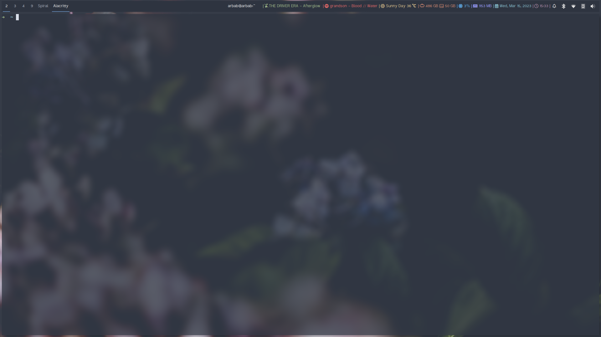
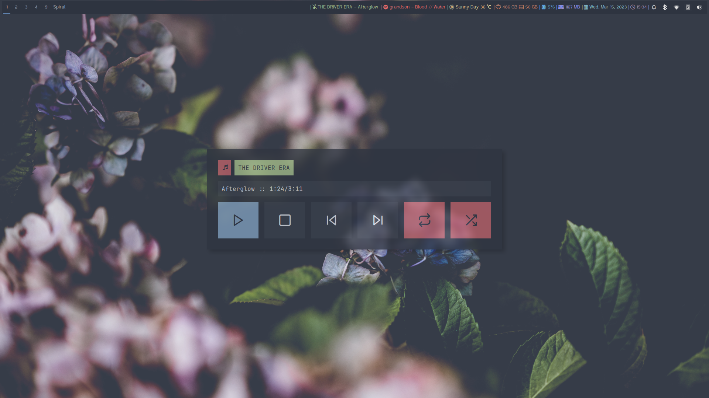

<h1 align="center">Personal Configuration Of Arbab Khan</h1>
## This is my personal configuration. This is not meant as a plug and play configuration. 

## Table Of Contents

- [About](#about)
- [Showcase](#showcase)
- [Workflow ](#workflow)
- [Important Keybindings](#keybindings)
- [What To Install](#installs)
- [Addition Notes](#notes)
- [Contributing](#contributing)

## Caution
This repo is tailored towards a 1920x1080 system to things may not look correct on other resolutions. This is something yourself to get working on your system. I might make things a bit more friendly on other resolutions in the future.

You need to be a little familiar with the following to get the most out of this repo

- [Xmonad](https://www.youtube.com/watch?v=3noK4GTmyMw)
- [Rofi](https://www.youtube.com/watch?v=TutfIwxSE_s&t=792s)
- [Bash scripting](https://www.youtube.com/watch?v=PPQ8m8xQAs8)
- [Emacs](https://www.youtube.com/watch?v=48JlgiBpw_I&t=1198s)

I have also linked good beginner resources if you need help with any of these.

This config also took a lot of inspiration from [adi1090x](https://github.com/adi1090x/rofi)'s rofi and [Axarva](https://github.com/Axarva/dotfiles-2.0)'s xmonad configs so check them out.

 
## About
As I said above, this is meant to be my personal configuration that I can clone on my system and get working instantly so many things are tailored to my personal liking. There may be some things you might want to change to get working to your liking.

 
## Showcase

 
## Workflow
This is meant to be a keyboard centric tiling workflow with vim style bindings and little scripts to make your day a little better.

## Keybindings
| Keybind               | Function                          |
|-----------------------|-----------------------------------|
| `Super + q `          | Close window                      |
| `Super + shift + q`   | Open rofi powermenu               |
| `Super + shift + c`   | Recompile xmonad                  |
| `Super + Space`       | Cycle through layouts             |
| `Super + t`           | Make a floating window tiled      |
| `Super + Space`       | Cycle through layouts             |
| `Super + tab`         | Cycle through workspace forwards  |
| `Super + shift + tab` | Cycle through workspace backwards |
| `Alt   + F4`          | Exit xmonad                       |
| `Super + e e`         | Open emacs                        |
| `Super + enter`       | Launch terminal (alacritty)       |
| `Super + z`           | Open thunar                       |
| `Super + shift + z`   | Open pcmanfm                      |
| `Super + d`           | Open rofi menu                    |
| `Super + d`           | Open rofi drun                    |
| `Super + g`           | Open screenshot menu              |
| `Super + x`           | Open rofi-mpd                     |
| `Super + b`           | Open browser menu                 |
| `Super + shift + b`   | Open browser (firefox)            |

**Note:** Make sure to go through .xmonad/xmonad.hs for additional keybindings.

## What To Install
These programs are required to get you started with this config so make sure to install them.
- [Xmonad](https://xmonad.org/download.html)
- [Polybar](https://github.com/polybar/polybar#installation)
- [Emacs](https://www.gnu.org/software/emacs/download.html)
- [i3lock](https://github.com/Raymo111/i3lock-color)
- [Zsh](https://github.com/ohmyzsh/ohmyzsh/wiki/Installing-ZSH)
- [Oh-my-zsh](https://ohmyz.sh/#install)
- [Alacritty](https://github.com/alacritty/alacritty/blob/master/INSTALL.md)
- [Dunst](https://github.com/dunst-project/dunst/wiki/Installation)
- [Mpd](https://mpd.readthedocs.io/en/stable/user.html)
- [Mpv](https://mpv.io/installation/)
- [Picom](https://github.com/ibhagwan/picom-ibhagwan-git) **Note:** Make sure to install the given fork instead of other forks
- [Rofi](https://github.com/davatorium/rofi#installation)
- [Zathura](https://github.com/pwmt/zathura)

### Optionally
- [i3](https://i3wm.org/downloads/)
**Note:** I used to use i3 before xmonad so that’s why I have a config for i3 in this repo but I don’t use it anymore so it’s not configured to use all my new scripts and stuff but it works well enough for a fallback wm so you can install it if you desire to do so.
- [sxhkd](https://github.com/baskerville/sxhkd)
**Note:** I have it here because I wanted to switch to it for all my non-xmonad related bindings such as alacritty etc but I found it to be buggy and decided not to do so, tough it is still configured for all my non wm related bindings so you can install it but I wouldn’t recommend to do so.

## Additional Notes

These are additional notes and instruction you have to follow to get this config up and running.

### Xmonad
#### Xmonad with Polybar
Xmonad with polybar was a bit tricky to get running, I had to use [xmonad-log](https://github.com/xintron/xmonad-log) to get things working. I have already put a compiled binary of xmonad-log in ‘.config/polybar/scripts‘ so no worries there but you do need to install `haskell-dbus` and `haskell-dbus-logger` manually through your package manager on your system’s package manager.

#### Xmonad startup
Xmonad starts up a lot of things configured for my system, such as `rclone` etc. Make sure to disable the ones you don’t need.

#### Xmonad-ctl
Xmonad-ctl is required for clickable icons with polybar and exit to login manager with rofi-powermenu. Make sure to use `-dynamic` flag when compiling `.xmonad/xmonadctl.hs`

### Emacs

#### Chemacs2
Emacs is setup with [chemacs2](https://github.com/plexus/chemacs2) to load multiple configs together without much hassle. If you don’t want this behavior, rename the `.emacs.default` to `.emacs.d` and delete `.emacs-profiles.el`. If you do want this behavior, just clone [chemacs2](https://github.com/plexus/chemacs2) as `.emacs.d` and add any extra configurations to `.emacs-profiles.el`.

**Note:** `.emacs-profiles.el` already has a few more configs setup, all you need to do is install their respective files to their expected directories.

#### All-the-icons
After first booting into emacs, make sure to do a `M-x all-the-icons-install-fonts RET`.

#### LSP
Make sure to install the language-servers in `.emacs.d/init.el` on your system.

## Contributing
If you see me doing anything inefficiently in this config or you think something would be useful to me or you want to correct some error on my part, feel free to open a pull request.

### Xmodmap
I have changed my caps key to ctrl and my right ctrl to caps to avoid emacs pink. If you don’t want this behavior, delete `.Xmodmap`.
